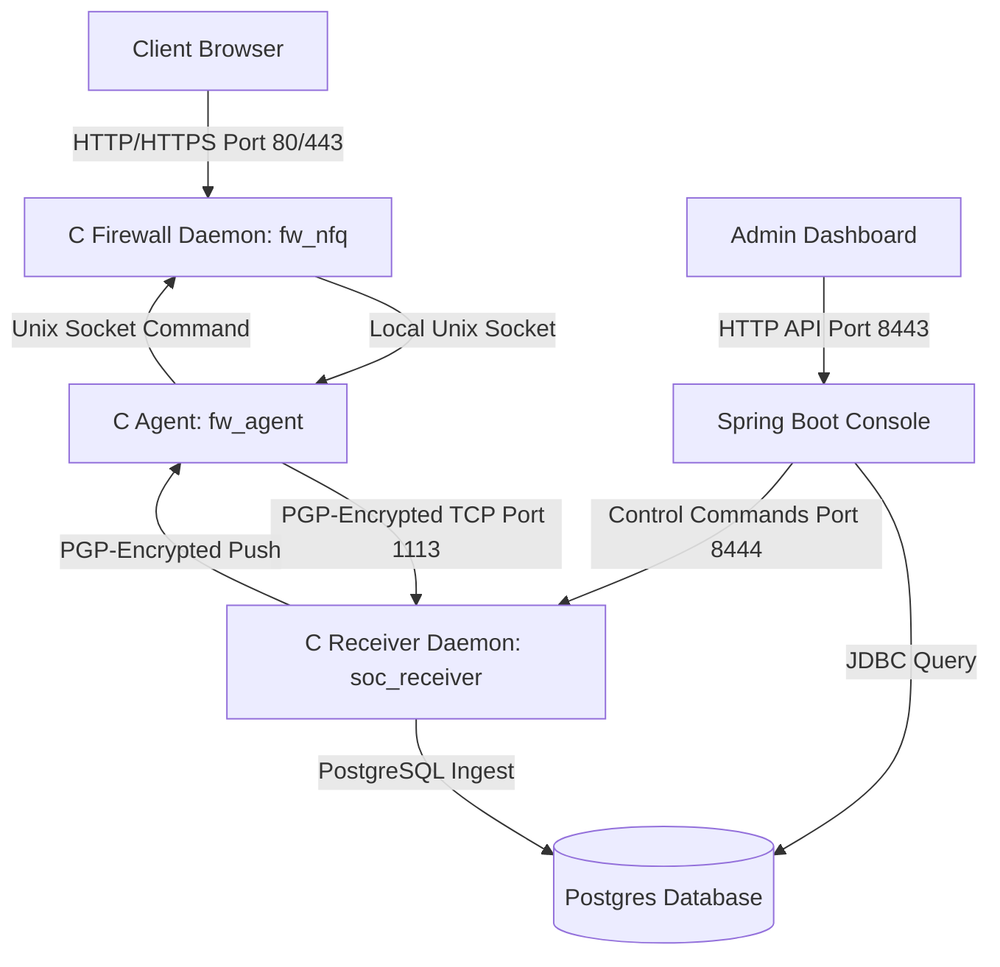

# Nullsploit Security Suite: Setup, Metrics, and Architecture

This document provides a comprehensive guide to setting up the Nullsploit firewall suite, details the underlying architecture, explains the detection metrics, and outlines key database schemas and security considerations.

---

## 1. System Architecture

Nullsploit is divided into three primary tiers:



1. **C Firewall Daemon (`fw_nfq`):** Runs at the kernel-user space boundary using `libnetfilter_queue`. Intercepts incoming network packets, evaluates them against rules (YARA, SQLi, Bot, Path Traversal), monitors connection states, and applies packet verdicts (`NF_ACCEPT` or `NF_DROP`).
2. **C Agent (`fw_agent`):** Gathers local alerts from `fw_nfq` via UNIX domain sockets, encrypts them using PGP, and transmits them to the centralized SOC receiver. It also receives block/unblock control commands and config directives from the SOC receiver.
3. **C Receiver Daemon (`soc_receiver`):** Receives PGP-encrypted alerts from agents, decrypts them, writes them to PostgreSQL, and listens for command connections on port 8444 from the Spring Boot API console to push policy changes back to agents.
4. **Java Spring Boot Console:** Serves the frontend web dashboard, manages system state, runs the asynchronous background AI detection service, handles dataset downloads, and issues administrative API commands to the receiver daemon.

---

## 2. Step-by-Step Setup Guide

### Prerequisites
- Docker & Docker Compose
- Web Browser

### Deployment Steps
1. Navigate to the root directory of the project:
   ```bash
   cd /path/to/apache-firewall
   ```
2. Build and launch all services in detached mode:
   ```bash
   docker-compose up --build -d
   ```
3. During startup:
   - The database service initializes the PostgreSQL instance and populates initial schemas.
   - The `soc_receiver` daemon boots and initializes the PGP keys in `/etc/keys` for secure agent communications.
   - The Spring Boot dashboard console starts on port 8443.
   - Apache containers (`apache-server-1`, `apache-server-2`) compile `fw_nfq` and `fw_agent`, configure `iptables` queue hooks, and connect to the receiver daemon.
4. Access the Enterprise Dashboard:
   - URL: `http://localhost:8443` (or `https://localhost:8443` if SSL is configured on the reverse proxy).
   - Log in using your admin credentials.

---

## 3. Database Schema

The database consists of the following key tables:

### `events`
Tracks raw firewall alert logs.
```sql
CREATE TABLE IF NOT EXISTS events (
  id SERIAL PRIMARY KEY,
  agent_uuid UUID NOT NULL,
  src_ip INET NOT NULL,
  dest_ip INET NOT NULL,
  src_port INT,
  dest_port INT,
  threat_type INT NOT NULL,
  severity INT NOT NULL,
  payload_preview TEXT,
  details TEXT,
  timestamp BIGINT NOT NULL
);
```

### `ip_reputation`
Keeps a moving malice score for attackers based on severity weights.
```sql
CREATE TABLE IF NOT EXISTS ip_reputation (
  ip INET PRIMARY KEY,
  score INT NOT NULL DEFAULT 0,
  local_score INT NOT NULL DEFAULT 0,
  external_score INT NOT NULL DEFAULT 0,
  attack_types TEXT[],
  updated_at TIMESTAMPTZ DEFAULT NOW()
);
```

### `ai_analysis_dataset`
Stores AI-based evaluations for every security event.
```sql
CREATE TABLE IF NOT EXISTS ai_analysis_dataset (
  id SERIAL PRIMARY KEY,
  event_id BIGINT UNIQUE REFERENCES events(id) ON DELETE CASCADE,
  threat_detected BOOLEAN NOT NULL,
  confidence INT NOT NULL,
  explanation TEXT,
  model_used TEXT,
  analyzed_at TIMESTAMPTZ DEFAULT NOW()
);
```

### `blocklist`
Stores IP addresses flagged for active packet dropping.
```sql
CREATE TABLE IF NOT EXISTS blocklist (
  id SERIAL PRIMARY KEY,
  ip_cidr CIDR NOT NULL,
  list_type TEXT NOT NULL DEFAULT 'block',
  source TEXT DEFAULT 'manual',
  reason TEXT,
  added_by TEXT,
  created_at TIMESTAMPTZ DEFAULT NOW()
);
```

---

## 4. Threat Detection Metrics

### SYN Flood Detection
- **Mechanism:** Monitors TCP packets with `SYN=1` and `ACK=0`.
- **Sliding Window:** 1 second (`HZ` in jiffies).
- **Threshold:** 100 SYN packets per second per connection state. If exceeded, the connection is flagged as blocked and future packets are immediately dropped.
- **Reputation impact:** IP reputation score is increased by 25 points on detection.

### Slowloris Mitigation (HTTP & HTTPS)
- **Mechanism:** Monitors ports 80 (HTTP) and 443 (HTTPS) for incomplete request streams.
- **Concurrent Sockets Metric:** Counts the number of active, unclosed connections in the pool originating from the same `src_ip`. If the count exceeds **20 concurrent incomplete requests**, the IP is flagged and blocked instantly.
- **Session Duration (Timeout):** If a connection remains open for longer than **30 seconds** without completing its HTTP request headers (`\r\n\r\n` not received on port 80), it is drop-verdicted.
- **FIN/RST Cleanup:** Connection entries are immediately purged from the pool upon receiving `FIN` or `RST` packets, avoiding false-positive timeouts.
- **Startup Probes/Healthcheck Filtering:** Connections that time out or close having transmitted **0 bytes of payload** (e.g. Docker TCP healthchecks) are silently ignored to prevent logging false-positive Slowloris events.

---

## 5. AI Dataset Generation

An asynchronous background thread (`AIService.java`) scans the database for new telemetry events.
- **Trigger:** Runs every 10 seconds, fetching up to 5 unanalyzed events.
- **Model:** Configurable via dashboard settings (defaults to `deepseek-v4-flash-free` via the OpenRouter API).
- **Evaluation:** Sends WAF log details and receives structured JSON indicating:
  1. `threat_detected` (boolean)
  2. `confidence` (0 - 100%)
  3. `explanation` (textual reasoning)
- **Export:** Admins can download the compiled dataset as a standard CSV format via the dashboard for ML model training and analysis.

---

## 6. Security Considerations

1. **Decoupled Control Planes:** The agent does not query the database. All blocks and configurations are pushed securely via the C receiver using PGP-encrypted sockets, preventing SQL injection or database access vector escalation from agent containers.
2. **Channel Encryption:** The TCP stream between the agent (`fw_agent`) and the receiver (`soc_receiver`) is PGP-encrypted using RSA 2048-bit keys generated during container startup.
3. **Session Token Validation:** The Spring Boot API console validates request authorization using cryptographically secure session tokens, preventing unauthenticated control command execution.
4. **Input Sanitization:** URL pattern entries, YARA rules, and IP fields are sanitized and validated to prevent remote command execution (RCE) on firewall nodes.
